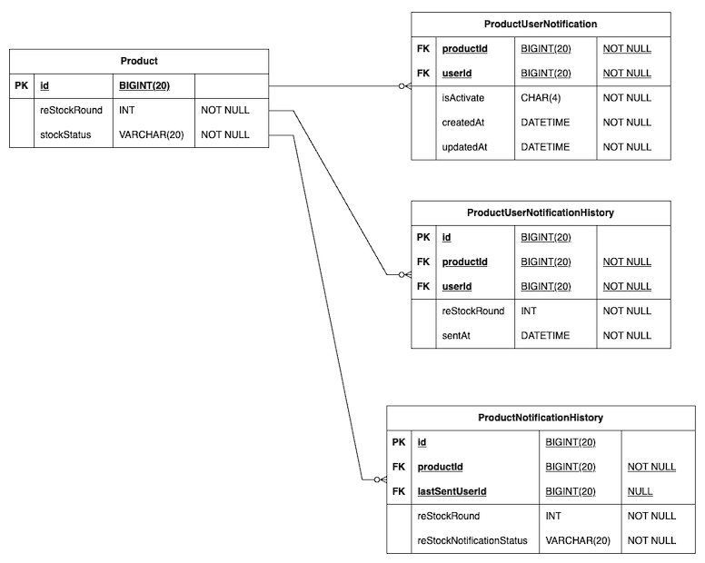

# 항해99-취업리부트코스-기업과제 02
- 상품이 재입고 되었을 때, 재입고 알림을 설정한 유저들에게 재입고 알림을 보내줍니다.

<details>
<summary>실행 방법</summary>

### 프로젝트 실행 방법
- github repository clone
- `./gradlew build` - Spring Project Build 및 jar 파일 생성
- `docker compsoe -f docker-compose.infrastructure.yml build` 
  - Infrastructure 용 docker compose Build 및 Image 생성
- `docker compose -f docker-compose.application.yml build`
  - Application 용 docker compose Build 및 Image 생성
- `docker compsoe -f docker-compose.infrastructure.yml up -d`
  - Infrastructure 용 Docker Compose 실행
- `docker compsoe -f docker-compose.application.yml up -d`
  - Application 용 Docker Compose 실행
</details>

## 과제 주요 구현 기능
- 재입고 알림 전송 기능
  - 상품이 재입고 되었을 때, 재입고 알림을 설정한 유저들에게 재입고 알림을 보내줍니다.
- 재입고 알림 재전송 기능
  - 예외에 의해 알림 메시지 발송이 실패한 경우, 재입고 알림을 재전송 할 수 있다.
  - 이때, 이전 전송 시 마지막으로 전송 성공한 이후 유저부터 알림을 전송한다.

> **고려하지 않아도 되는 사항**
> - 시스템 구조 상 비동기로 처리 되어야 하는 부분은 존재하지 않는다고 가정합니다.
> - 회원가입, 로그인은 고려하지 않습니다.
> - 알림 메시지 전송 시, 서드 파티 연동을 하지 않으며, ProductNotificationHistory 테이블에 데이터를 저장한다.

<details>
<summary>기능 명세서</summary>

### 재입고 알림 전송 기능

**기능 설명**

- 상품이 재입고 되었을 때, 재입고 알림을 설정한 유저들에게 재입고 알림을 보내줍니다.


- 재입고 알림 전송 API
  - POST /products/{productId}/notifications/re-stock
  - 요청 파라미터
 
  | param | description |
  | --- | --- |
  | productId | 상품 아이디 |

- 응답 예시

  None.


**비즈니스 요구 사항**

- 재입고 알림을 전송하기 전, 상품의 재입고 회차를 1 증가합니다.
  - Product (상품) 테이블
    
    | id | 상품 Id |
    | --- | --- |
    | reStockRound | 재입고 회차 |
    | stockStatus | 재고 상태 |

    - stockStatus (재고 상태)
        - IN_STOCK (재고 있음)
        - OUT_OF_STOCK (재고 없음)


- 재입고 알림 전송의 기록을 저장한다. (상태 저장)
  - ProductNotificationHistory (상품별 재입고 알림 히스토리)

    | id | 히스토리 Id |
    | --- | --- |
    | productId | 상품 Id |
    | reStockRound | 재입고 회차 |
    | reStockNotificationStatus | 재입고 알림 전송 상태 |
    | lastSentUserId | 마지막 발송 유저 Id |
  
    - reStockNotificationStatus (재입고 알림 전송 상태)
        - IN_PROGRESS (발송 중)
        - CANCELED_BY_SOLD_OUT (품절에 의한 발송 중단)
            - 재입고 알림을 보내던 중 재고가 모두 없어진다면, 알림 보내는 것을 중단한다.
        - CANCELED_BY_ERROR (예외에 의한 발송 중단)
            - 서드 파티 연동에서의 예외 를 의미한다.
        - COMPLETED (완료)


- 재입고 알림을 설정한 유저들에게 알림 메시지를 전달합니다.
  - ProductUserNotification (상품별 재입고 알림을 설정한 유저) 테이블
  
    | productId | 상품 Id |
    | --- | --- |
    | userId | 유저 Id |
    | isActivate | 활성화 여부 |
    | createdDate | 생성 날짜 |
    | updatedDate | 수정 날짜 |
    
    - ProductUserNotification 테이블에 존재하는 유저는 모두 재입고 알림을 설정하였다.
    - 재입고 알림은 재입고 알림을 설정한 유저 순서대로 메시지를 전송한다.


- 재입고 회차별 재입고 알림을 받은 유저 목록을 저장한다.
  - ProductUserNotificationHistory (상품 + 유저별 재입고 알림 히스토리) 테이블

    | id | 히스토리 Id |
    | --- | --- |
    | productId | 상품 Id |
    | userId | 유저 Id |
    | reStockRound | 재입고 회차 |
    | sendedDate | 발송 날짜 |

**기술적 요구 사항**

- 알림 메시지는 1초에 최대 500개의 요청을 보낼 수 있다.
- Mysql 조회 시, 인덱스를 잘 탈 수 있게 설계해야 합니다.

---

### 재입고 알림 재전송 기능

**기능 설명**

- 알림 메시지 전송 실패한 경우, 다시 알림 메시지를 전송합니다.


- (manual) 재입고 알림 전송 API
  - POST admin/products/{productId}/notifications/re-stock
  - 요청 파라미터
  
  | param | description |
  | --- | --- |
  | productId | 상품 아이디 |

- 응답 예시

  None.


- 재입고 알림 전송의 요구 사항을 동일하게 만족해야 하며, 추가적으로 만족해야 하는 요구사항은 아래와 같다.
- 다만, 실패 후 요청이기 때문에, 재입고 회차를 증가하지 않는다.

**비즈니스 요구 사항**

- **예외에 의해 알림 메시지 전송이 실패한 경우**, manual 하게 상품 재입고 알림 메시지를 다시 보내는 API를 호출한다면 마지막으로 전송 성공한 이후 유저부터 다시 알림 메시지를 보낼 수 있어야 한다.
  - 10번째 유저까지 알림 메시지 전송에 성공했다면, 다음 요청에서 11번째 유저부터 알림 메시지를 전송할 수 있어야 한다.

</details>

<details>
<summary>API 문서</summary>

### 재입고 알림 전송 기능

**설명**

path parameter {productId} 에 해당하는 상품에 대한 재입고 알림을 전송합니다.

**요청**

POST `http://localhost:8080/products/{productId}/notifications/re-stock`

- Path Parameter
    
    | 이름 | 타입 | 설명 | 필수 |
    | --- | --- | --- | --- |
    | productId | Integer | 상품 DB Id | O |

**응답** - 성공

- HTTP 상태코드 : 200 OK

---

### 재입고 알림 메시지 재전송 기능

**설명**

path parameter {productId} 에 해당하는 상품에 대한 재입고 알림 실패 시, 다시 알림 메시지를 전송합니다.

**요청**

POST `http://localhost:8080/admin/products/{productId}/notifications/re-stock`

- Path Parameter

    | 이름 | 타입 | 설명 | 필수 |
    | --- | --- | --- | --- |
    | productId | Integer | 상품 DB Id | O |

**응답** - 성공

- HTTP 상태코드 : 200 OK

</details>

## ERD 설계 및 Database Table DDL


### [DDL - code 링크](https://github.com/yuseogi0218/hanghae99-task02/blob/main/src/main/resources/database/schema.sql)

## 주요 구현 사항

### 재입고 알림 전송 기능 비즈니스 로직 순서

1. productId 에 해당하는 상품의 재입고 회차를 1 증가시킨 후, 재고 있음 상태로 변경한다.
2. productId 에 해당하는 상품을 조회 후, 상품별 재입고 알림 히스토리를 생성합니다.
   - 이때, 상품별 재입고 알림 히스토리의 값은 아래과 같이 초기화 한다.
     - reStockNotificationStatus (재입고 알림 전송 상태) : IN_PROGRESS (발송 중)
     - lastSentUserId (마지막 발송 유저 Id) : null
3. productId 에 해당하는 상품별 재입고 알림 히스토리를 조회 후, 알림을 처리하는 Event 를 발행한다.
   - Event 는 Queue 의 형태로 관리되며, 재입고 알림 전송 기록 DB Id 를 하나의 Event로 관리한다. 

- 이를 구현한 API (컨트롤러) 코드는 아래와 같습니다.
``` java
public ResponseEntity<?> sendReStockNotification(
        @PathVariable("productId") Long productId
) {
    productService.reStockById(productId);
    productNotificationService.createProductNotificationHistory(productId);
    productNotificationService.publishReStockNotificationEvent(productId);

    return ResponseEntity.ok().build();
}
```

### 재입고 알림 Event 처리 로직
**[Event 처리 코드 (EventConsumer)](https://github.com/yuseogi0218/hanghae99-task02/blob/main/src/main/java/hanghae99/reboot/notification/common/eventQueue/EventConsumer.java)**

- Event 처리는 아래와 같은 로직으로 1초에 한번 씩 실행된다.
```java
@Scheduled(fixedDelay = 1000) // 1초마다 실행
public void consumeEvent() { 
    // Event 처리 로직 
    ...
}
```

- Event 진행 시, 현재 Event 에서 전송한 알림 메시지와 전송이 성공한 결과를 임시 저장한다.
```java
// 현재 이벤트에서 전송한 메시지 개수
int sentMessageCount = 0;
List<ProductUserNotificationHistory> productUserNotificationHistories = new ArrayList<>();
```

1. Event 큐가 비어있지 않거나, 현재 처리에서 500개를 보내지 않았다면 반복문 내부 로직을 실행한다.
   ``` java
   while (!eventQueue.isEmpty() && sentMessageCount < 500) {
      // 반복문 내부 로직
      ...
   }
   ```
2. 반복문 내부 로직은 아래와 같습니다.
   1. EventQueue 의 Top값 (먼저 들어온 Event 를 먼저 처리합니다.)을 확인합니다.
        ```java
        // 수행할 이벤트(재입고 알림 전송 기록 Id) 확인
        Long productNotificationHistoryId = eventQueue.peekEvent();
        ```
   2. 재입고 알림 전송 기록 DB Id 를 사용하여, (현재 진행중 or 예외에 의해 취소됨)에 해당하는 재입고 알림 전송 기록을 조회한다.
       - 재입고 알림 전송 기록이 존재하지 않다면, EventQueue 의 Top 값을 제거 후 다음 반복문을 실행한다.
      ```java
      // 재입고 알림 전송 기록 DB Id를 사용하여 (진행 중 이거나, 예외에 의해 중지된) 재입고 알림 전송 기록 조회
      Optional<ProductNotificationHistory> productNotificationHistoryOptional
               = productNotificationService.getProductNotificationHistoryByIdAndReStockNotificationStatusIsInProgressOrCanceledByError(productNotificationHistoryId);

      // 존재하지 않다면, 해당 이벤트를 이벤트 큐에서 제거 후, 다음 이벤트 진행
      if (productNotificationHistoryOptional.isEmpty()) {
          eventQueue.removeEvent();
          continue;
      }
      ```
      - 존재한다면, 이벤트 (알림 메시지 전송) 을 진행합니다.
   3. 알림 메시지 전송
      - productId 에 해당하는 알림을 전송할 유저 Id 목록을 조회합니다. (lastSentUserId, size) 고려
      ``` java
      Product product = productNotificationHistory.getProduct();
      Long productId = product.getId();
      Long lastSentUserId = productNotificationHistory.getLastSentUserId();
      Integer size = (MESSAGE_LIMIT_IN_ONE_SECONDS - sentMessageCount);

      // 알림 전송할 유저 목록 확인
      // productId 에 해당하는 유저 중에서, lastSentUserId 이후 부터, (500 - bulkNotifications.size()) 명 만큼 보낼 수 있음
      // Page -> 다음 페이지가 있는지 확인하기 위함
      Page<Long> productUserNotificationUserIdsPage = productNotificationService.getUserIdOfProductUserNotificationByProductId(productId, lastSentUserId, size);
      Integer reStockRound = productNotificationHistory.getReStockRound();
      List<Long> userIds = productUserNotificationUserIdsPage.getContent();
      
      for (Long userId : userIds) {
          try {
              SendReStockNotificationDTO sendReStockNotificationDTO = SendReStockNotificationDTO.builder()
                      .productId(productId)
                      .userId(userId)
                      .reStockRound(reStockRound)
                      .build();
              // 알림 전송
              ProductUserNotificationHistory productUserNotificationHistory =
                      productNotificationService.sendReStockNotification(sendReStockNotificationDTO);
              productUserNotificationHistories.add(productUserNotificationHistory);
              sentMessageCount++;
          } catch (CustomException e) {
              // 재입고 알림을 보내던 중 재고가 모두 소진된다면, 알림 보내는 것을 중단한다.
              if (e.getErrorCode().equals(ProductErrorCode.OUT_OF_STOCK.getCode())) {
                  productNotificationHistory.canceledBySoldOut();
              } else {
                  // 써드 파티 연동에서의 예외
                  productNotificationHistory.canceledByError();
              }
              break;
          }
          lastSentUserId = userId;
      }
      ```
   
   4. 이후 알림 메시지 전송에 대한 결과 처리를 수행합니다.
   ``` java
   // 성공적으로 다 보냈지만, 아직 모든 사람에 대해서 알림을 전송하지 못하였을 경우
   if (!productUserNotificationUserIdsPage.isLast() && productNotificationHistory.statusIsInProgress()) {
       productNotificationHistory.updateLastSentUserId(lastSentUserId);
   // 성공적으로 다 보냈고, 모든 사람에 대해서 알림을 전송한 경우
   } else if (productUserNotificationUserIdsPage.isLast() && productNotificationHistory.statusIsInProgress()) {
       productNotificationHistory.complete();
       eventQueue.removeEvent();
   // 메시지를 보내는 중간에 에러가 발생한 경우
   } else if (productNotificationHistory.statusIsCanceled()) {
       eventQueue.removeEvent();
   }
   
   // 상품 알림 전송 기록의 변경 사항을 저장합니다.
   productNotificationService.saveProductNotificationHistory(productNotificationHistory);
   ```
   
- while 반복문 종료 후, 알림 전송 기록을 저장합니다.
``` java
// 알림 전송 기록 저장
productNotificationService.saveAllProductUserNotificationHistories(productUserNotificationHistories);
```

### 재입고 알림 메시지 재전송 기능
- 기존 재입고 알림 전송 기능 비즈니스 로직에서, 아래의 로직만 남겨두면 비즈니스 요구사항에 맞게 작동한다.
  - productId 에 해당하는 상품별 재입고 알림 히스토리를 조회 후, 알림을 처리하는 Event 를 발행한다.
      - Event 는 Queue 의 형태로 관리되며, 재입고 알림 전송 기록 DB Id 를 하나의 Event로 관리한다. 

- 이를 구현한 API (컨트롤러) 코드는 아래와 같습니다.
``` java
public ResponseEntity<?> sendReStockNotification(
        @PathVariable("productId") Long productId
) {
    productNotificationService.publishReStockNotificationEvent(productId);

    return ResponseEntity.ok().build();
}
```

## 테스트 코드 작성
- (진행 중)

## 추가적으로 고려해야 할 사항
- 재입고 알림 전송 시, 재고 소진 여부를 확인하기 위해 Redis를 Cache Database 용도로 사용한다.
  - 현재는 매번 Database 로부터 상품을 조회 후, 재고 여부를 확인하는 로직을 거친다. 이를 Redis 를 사용하여 Cache 를 구현한다면 성능 향상이 기대된다.
- MessageQueue 가 가득 찬 상황을 고려해야 할 거 같다.
  - 메시지를 Redis 와 같은 In-Memory DB 로 전환하여 구현할 수 있을거 같다.